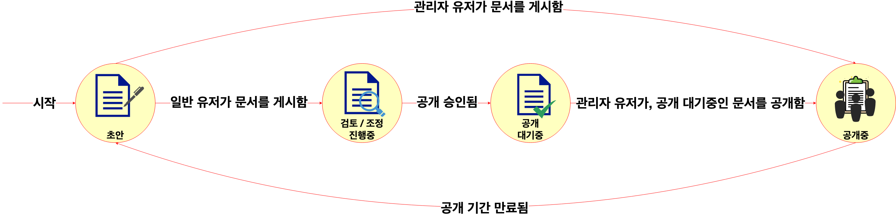

# spring-statemachine-studies

## 개요
- spring-statemachine 프레임워크를 활용하여, 간단한 유한 상테기계를 만들어 본다.

## 문서관리 상태 전이도 및 각 항목별 명세

### 상태 전이도

### 각 상태별 명세
- `초안` : 문서가 최초로 등록되었을 때, 최초로 부여된다.
- `검토 / 조정 진행중` : 관리자에 의해 공개 가능 여부를 검토받아야 하는 상태이다.
- `공개 대기중` : 관리자에 의해 공개승인을 받은 상태로, 대외 공개를 기다리고 있는 상태이다.
- `공개중 ` : 공개 대기중인 문서 중, 관리자가 대외 공개까지 진행해주어, 외부 방문자가 문서의 내용을 확인할 수 있는 상태이다.
### 각 이벤트별 명세
- `일반 유저가 문서를 게시함` : 일반 유저가 문서를 게시할 때 발생하는 이벤트이다. 이 때, 일반 유저가 올린 문서의 상태는 `초안` 상태에서 `검토 / 조정 진행중` 상태로 변경된다.
- `관리자가 문서를 게시함` : 관리자 유저가 문서를 게시할 때 발생하는 이벤트이다. 이 때, 관리자 유저가 올린 문서의 상태는 일반 유저의 문서와는 다르게, `초안` 상태에서 `공개` 상태로 바로 변경된다.
- `공개 승인받지 못함` : 관리자에가 일반 유저가 게시한 문서에 대외공개 승인을 하지 않았을 경우에 발생하는 이벤트이다. 이 때, 문서의 상태는 `검토 / 조정 진행중` 상태에서 `초안` 상태로 변경된다.
- `공개 승인됨` : 관리자가, 일반 유저가 게시한 문서를 대외공개 승인을 진행했을 때 발생하는 이벤트이다. 이 때, 문서의 상태는 `검토 / 조정 진행중` 상태에서 `공개 대기중` 상태로 변경된다.
- `관리자 유저가, 공개 승인받은 문서를 대외 공개함` : 관리자가 공개 대기중인 문서를, 최종적으로 대외 공개를 진행할 때 발생하는 이벤트이다. 이 때, 문서의 상태는 `검토 / 조정 진행중` 상태에서 `공개중` 상태로 변경된다.
- `공개 기간 만료됨` : 공개중인 문서의 공개 기한이 만료되었을 경우 발생하는 이벤트이다. 이 때, 문서의 상태는 `검토 / 조정 진행중` 상태에서 `공개 대기중` 상태로 변경된다.
